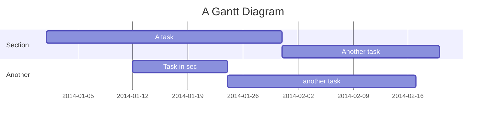

this is how we create dataframe
<!-- NOTE-swimm-snippet: the lines below link your snippet to Swimm -->
### 📄 src/00-intro/streamlit-example.py
```python
8      chart_data = pd.DataFrame(np.random.randn(30, 3),
```

<br/>

`chart_data`<swm-token data-swm-token=":src/00-intro/streamlit-example.py:8:0:0:`chart_data = pd.DataFrame(np.random.randn(30, 3),`"/> is where `random`<swm-token data-swm-token=":src/00-intro/streamlit-example.py:8:10:10:`chart_data = pd.DataFrame(np.random.randn(30, 3),`"/>

<br/>

|key |value |
|----|------|
|key1|value1|
|key2|value2|

<br/>

<!--MERMAID {width:100}-->

<!--MCONTENT {content: "gantt<br/>\ntitle A Gantt Diagram<br/>\ndateFormat YYYY-MM-DD<br/>\nsection Section<br/>\nA task :a1, 2014-01-01, 30d<br/>\nAnother task :after a1 , 20d<br/>\nsection Another<br/>\nTask in sec :2014-01-12 , 12d<br/>\nanother task : 24d<br/>\n\n<br/>"} --->

<br/>

*   sjndjkfd

*   kdvkdjnvjdf

*   kasnvkjdnfv

> skdjncjsdnvjndvjdnsfjvdf
> 
> aksndcjnkjvfdjvnfdjk

```python
def a () -> int :
return 1
```

<br/>

<br/>

This file was generated by Swimm. [Click here to view it in the app](https://app.swimm.io/repos/Z2l0aHViJTNBJTNBc2VydmVybGVzcy1tbC1jb3Vyc2UtMSUzQSUzQXBwamFkMDY=/docs/n76qq).
